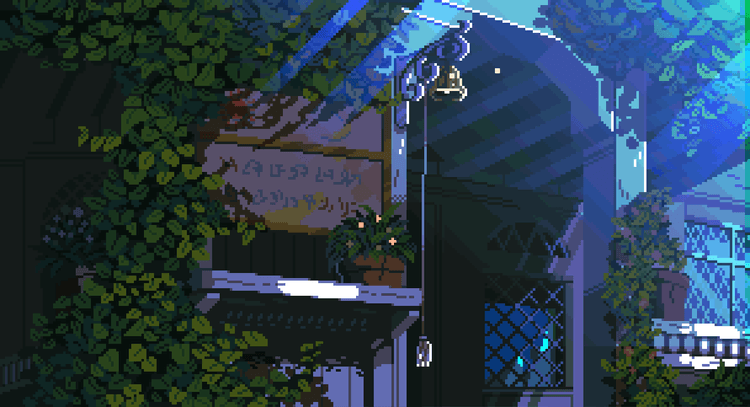

<h1>Olá, seja bem vindo(a) ao meu perfil.</h1>

<h2>Sobre mim: </h2>
👨‍💻 Desenvolvedor Fullstack a 3 anos  
💻 Estudando e me aprimorando  
🎨 Designer UX/UI  
📖 Apreciador de livros de mistérios  
🎮 Um jogador nas horas vagas  
👔 Atualmente em busca de oportunidades na área  
 

  
📔 Mais sobre mim mesmo

  Estou estudando para me tornar um desenvolvedor Full-Stack. Sou apaixonado por tecnologia e quero explorar ao máximo esse universo. Embora meu foco atual seja o desenvolvimento web, também tenho grande interesse em Desenvolvimento de Jogos e Cyber Security — não quero me limitar a uma única área da programação.
Fora do código, gosto de relaxar lendo livros de mistério (sou fã das histórias da Agatha Christie!) e jogando videogame, que também me inspira bastante na parte criativa e na curiosidade por como os jogos são feitos.

<h2>🚀 Main Skills</h2>

 
 
 
 
 
 
 
 
 
 
 
 
 
  

<h2>🔧 Tools</h2>

 <h2>🎓 Formação acadêmica e certificados</h2>
💻 Curso técnico desenvolvimento de sistemas - SENAI (conclusão em dez/2024)  
📃 SC900 - Microsoft (adquirido em 2023)

<h2 align= "left">🏆 Status: </h2>

<h2>Meus contatos:</h2>

  
  

<h2 align= "left">📒 Guestbook: </h2>

Deixe um comentario sobre o meu perfil. Pode comentar o que quiser. É só clicar no GIF abaixo:

  

